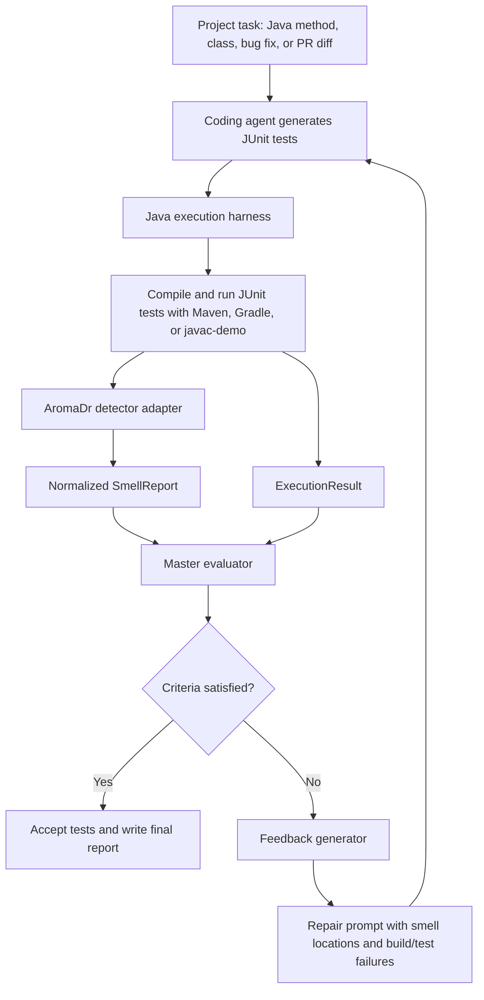

# Architecture

## Goal

Build a goal-driven repair loop for agent-generated Java tests. The master agent does not trust a generated test suite just because it compiles or passes. It checks deterministic quality signals, especially AromaDr test smell reports, and asks the coding agent to repair the tests until the criteria are satisfied or the iteration budget is exhausted.

## End-to-End Flow



## Components

| Component | File | Responsibility |
| --- | --- | --- |
| Coding agent | `test_repair_mvp/agents.py` | Provides the deterministic template backend and the DeepSeek V4 Pro backend with JSON and Java safety validation. |
| Execution harness | `test_repair_mvp/harness.py` | Compiles and runs tests. Supports JUnit-style `javac-demo` now and includes Maven/Gradle command paths for real Java projects. |
| AromaDr adapter | `test_repair_mvp/detectors.py` | Calls AromaDr's HTTP API through `AROMADR_API_URL`, or an external command through `AROMADR_CMD`, and normalizes findings into `SmellReport`. |
| Lightweight detector | `test_repair_mvp/detectors.py` | Keeps the MVP runnable without AromaDr. Detects generic names, missing assertions, broad tests, missing exception cases, and mock overuse. |
| Master evaluator | `test_repair_mvp/feedback.py` | Applies compile/test criteria and treats AromaDr findings as authoritative when AromaDr is available. |
| Feedback generator | `test_repair_mvp/feedback.py` | Converts execution and smell findings into actionable repair instructions. |
| Orchestrator | `test_repair_mvp/orchestrator.py` | Owns the generate -> execute -> detect -> evaluate -> repair loop. |
| Reporting | `test_repair_mvp/reporting.py` | Saves per-iteration test snapshots, smell reports, execution results, and a final Markdown summary. |
| Benchmark runner | `test_repair_mvp/benchmark.py` | Runs multiple tasks and creates aggregate before-after CSV, JSON, and Markdown reports. |
| Dataset scanner | `test_repair_mvp/dataset_scanner.py` | Discovers Maven projects, checks `mvn test-compile` and `mvn test`, batch-scans Java test files with AromaDr, and writes candidate repair reports. |
| Candidate adapter | `test_repair_mvp/candidate_repair.py` | Copies arbitrary Maven candidates, checks eligibility, runs bounded DeepSeek repairs, validates or rolls back changes, isolates failures, and writes aggregate reports. |

## Data Contracts

### ProjectTask

Defines one benchmark item:

- `task_id`
- `project_root`
- `source_under_test`
- `test_file`
- `target_description`
- `build_tool`
- `max_iterations`
- `source_roots`
- `test_runner_class`
- `max_accepted_smells`

### ExecutionResult

Captures build and test status:

- `compiled`
- `passed`
- `test_count`
- `failure_count`
- raw command, stdout, and stderr

### SmellReport

Normalizes AromaDr or fallback detector output:

- `detector`
- `aroma_dr_available`
- `findings`
- `count`
- `by_type`
- `raw_output`

### EvaluationDecision

The master agent's decision:

- `accepted`
- `reasons`
- `feedback_items`
- `criteria`

## Success Criteria in the MVP

A repaired test suite is accepted when:

1. The generated Java test file compiles.
2. The generated tests pass.
3. AromaDr reports no findings when available. Lightweight findings remain
   diagnostic; the combined fallback count is used only when AromaDr is absent.

The real research version can tune `max_accepted_smells` and extend these criteria with JaCoCo coverage, changed-line coverage, manual labels, and PIT mutation score.

## How This Maps to the Proposal

| Proposal Item | MVP Coverage |
| --- | --- |
| Java/JUnit target | Demo uses Java source and Java test files; Maven/Gradle paths are present for real JUnit projects. |
| AromaDr integration | `AROMADR_API_URL` posts generated JUnit test files to AromaDr's `/file-test-smells/detect`; command fallback also exists. |
| Goal-driven master agent | `MasterEvaluator` rejects tests until build, execution, and smell criteria pass. |
| Smell-based feedback | `FeedbackGenerator` turns smell types and locations into repair instructions. |
| Before-after evaluation | Single-task and benchmark reports compare initial and final smell count, pass status, test count, and artifacts. |
| Iteration budget | `max_iterations` is configured per task. |

## Benchmark Evaluation

`demo/config/benchmark.json` lists task config files. The benchmark currently includes two zero-dependency Java/JUnit-style tasks and one real Maven/JUnit 5 task. The benchmark runner executes each task in an isolated copy of its Java project and writes:

- `benchmark_summary.json`
- `benchmark_results.csv`
- `benchmark_report.md`
- per-task iteration artifacts under `tasks/<task_id>/artifacts`

The DataTD workflow now also has a fixed 40-file subset. Ten candidates were
used for development: 4 were eligible and all 4 were accepted. A separate
held-out evaluation is still required.

## Dataset Preparation

The scanner mode prepares larger Maven datasets for the repair loop:

```bash
python3 -m test_repair_mvp --scan-dataset /path/to/maven/dataset --dataset-report-dir .mvp_runs/dataset-scan
```

For each discovered `pom.xml`, it records whether the project has Java tests,
whether `mvn test-compile` succeeds, and whether `mvn test` succeeds. It then
scans each `src/test/java/**/*Test.java`, `*Tests.java`, or `*TestCase.java`
file with the configured detector pipeline. A test file is marked as a candidate
when the project compiles, tests pass, and at least one smell is reported.

This is the bridge between the MVP demo and larger datasets such as DataTD:
first identify compilable, runnable, smelly test files, then convert selected
rows from `candidate_tests.csv` into repair tasks.

## AromaDr HTTP Adapter

When `AROMADR_API_URL` is set, the detector sends:

```json
{
  "language": "java",
  "framework": "junit",
  "testFileContent": "..."
}
```

to `POST /file-test-smells/detect` and parses AromaDr's `testSuites[].tests[].testSmells[]` response. If AromaDr is not reachable, the repair loop records that AromaDr was unavailable and uses the lightweight detector to keep development and demos unblocked.

## DeepSeek Repair Path

`--coding-backend deepseek` is explicit opt-in. The candidate adapter first
runs a baseline; only candidates that compile, pass tests, reach AromaDr, and
contain an AromaDr finding are sent to the API. The backend receives bounded
authorized context, requires structured JSON, validates the target path,
package, and public class, and writes the isolated test atomically. Maven and
AromaDr validate each proposal. Rejected or exceptional changes are restored.

## Next Steps Toward Final Research Delivery

1. Add API budget, accurate cache-aware cost, transient retry, and resume controls.
2. Freeze the prompt/configuration and exclude development candidates.
3. Build and run a held-out DataTD evaluation cohort.
4. Produce per-smell, per-project, failure, runtime, token, and cost analyses.
5. Add reproducibility manifests and representative semantic reviews.
6. Publish advisor-facing reports; optionally add JaCoCo and PIT.
